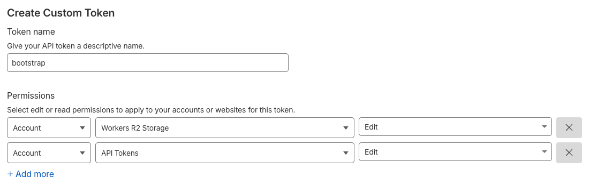

# Organization Bootstrap Scripts

This repository contains a collection of OpenTofu and helper scripts used to bootstrap and manage the shared OpenTofu state backend for the organization. It automates the creation of a Cloudflare R2 bucket, generation of scoped API credentials, and registration of the necessary GitHub organization secrets so that other infrastructure repositories can securely and consistently store their state files.

## Preconditions

### Bootstrap API Token

Before running the bootstrap scripts, we need to create an **Account API Token**. This token is used during setup to create the R2 bucket and generate a scoped API token for Terraform state management. In the Cloudflare dashboard, navigate to **Manage Account → Account API Tokens → Create Token**. Assign it the **Account:Workers R2 Storage:Edit**, **Account:API Tokens:Edit** permissions. Copy the token value and store it securely.




### Set Terraform Variables

Create a file named `terraform.tfvars` in the root of this repository. Paste in the following variables and replace the placeholder values with your actual Cloudflare credentials.

Tip: You can find your account ID in the URL of your Cloudflare dashboard.

```hcl
cloudflare_account_id = "<your-account-id>"
cloudflare_api_token  = "<your-bootstrap-api-token>"
````

Once this file is created, OpenTofu will automatically load these variables when you run commands.

## Running OpenTofu

Initialize the working directory to install the required providers.

```bash
tofu init
```

Next, create an execution plan to review the proposed changes.

```bash
tofu plan
```

If the plan looks good, apply it to provision the resources.

```bash
tofu apply
```

If everything is configured correctly, OpenTofu will:

* Create an R2 bucket to store Terraform state for other projects.
* Generate an account API token with the appropriate permissions to access that bucket.

Once the process is complete, you can safely revoke or delete the temporary bootstrap token you used earlier.

## Push Organization Secrets

Next, make the generated token and R2 bucket information available to your GitHub organization so that other Terraform projects can reuse them.

This repository includes a helper script named `set-organization-secrets.sh`, which uses the GitHub CLI (`gh`) to set these secrets automatically.

Run the following command, replacing `<org-name>` with your GitHub organization name.

```bash
./set-organization-secrets.sh <org-name>
```

This command pushes the new Cloudflare token and R2 bucket details as organization-level secrets and configures them with `--visibility all` so that both public and private repositories in your organization can access them securely.

After this step, other repositories can reference these secrets in their GitHub Actions workflows to configure their OpenTofu state backend.

### workflow.yml

```yml
TODO
```

### providers.tf

```hcl
TODO
```
